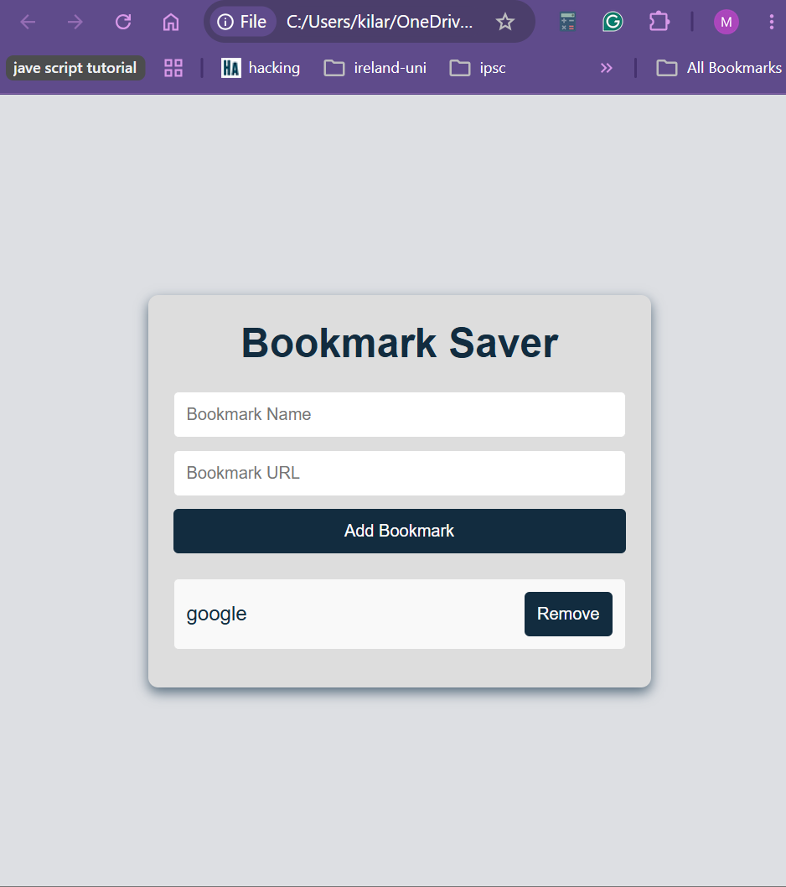

# Bookmark Saver

A fast, lightweight bookmark manager built with vanilla JavaScript. It lets you save and organize your favorite web links with instant visual feedback and automatic saving across browser sessions.



---

## Features

* **Automatic Saving:** Uses the browser's **LocalStorage API** to keep your bookmarks saved even after closing or refreshing the tab, all without needing an external database.
* **Link Validation:** Checks your inputs automatically to make sure links aren't empty and include proper `http://` or `https://` prefixes to prevent broken shortcuts.
* **Responsive Layout:** Built with clean CSS Flexbox so the interface adjusts smoothly across mobile, tablet, and desktop screens.
* **Modern Styling:** Features interactive hover effects and clean drop shadows to give the UI a polished, modern depth.

---

## Technical Highlights

* **Zero Dependencies:** Written entirely in pure, modern JavaScript (ES6+) with no heavy frameworks or libraries (like React or Vue) required.
* **Clean Event Handling:** Keeps JavaScript logic cleanly separated from the HTML markup using dynamic event listeners.
* **Semantic HTML5:** Built using standard web structure tags to ensure better accessibility and cleaner code organization.

---

## Quick Start

Since this project runs directly in the browser, you don't need any complex build tools, servers, or installation steps:

1. Clone the repository:
   ```bash
   git clone https://github
